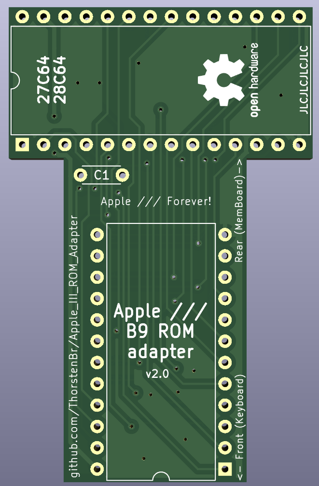

# Apple III ROM Adapter (B9 ROM)
* This project contains the design for an adpater for the Apple /// "**B9 ROM**" (the main system ROM to boot the 6502 CPU).
* Replaces the stock 4KB ROM with a programmable **27C64 EPROM or 28C64 EEPROM** (8KB).

The Apple /// supports two 4KB ROM banks, though the originally installed Apple /// ROM was only 4KB.

The option to install a custom ROM can be useful though. You can install a ROM variant providing additional features - such as bootstrapping from a (virtual) harddisk (ProDOS interface cards), or installing a ROM with an extended "debug monitor".

## Custom ROM Adapter
The PCB adapts the Apple ///'s pinout for a "2532" ROM to a more common 27c64/28c64 EPROM/EEPROM.
It also takes care of providing the necessary clearance.
The Apple ///'s "B9" ROM is located in a tight space directly below the keyboard.
Simple, generic ROM adapters will not fit in this restricted space.
This adapter was designed to move the top (E)PROM as far to the rear as possible (closer to the memory board). This provides the necessary clearance (since the keyboard slopes upwards towards the rear).

## Building the Adapter

### Schematics and KiCad Project
The [KiCad](KiCad/) folder contains the schematics and PCB project files, if you wished to adapt the design.

A [schematics PDF](KiCad/Apple_III_ROM_Adapter-Schematics.pdf) is also available.

### Gerber Files
Here is a [ZIP file containing the Gerber files](Gerber/Apple_III_ROM_Adapter-v2.0.zip) required to order PCBs.

I ordered mine using a slightly thinner PCB thickness than usual: 1.2mm (default is usually 1.6mm).
The cost was the same. And since the clearance in the Apple /// chassis is major concern, I went with the thinner variant.

This worked great. For this tiny PCB the 1.2mm is absolutely enough. It turned out, however, that the PCB design provides more than enough clearance anyway. So the thinner 1.2mm PCB wasn't essential.

### PCB Design
**Top side:**

**Bottom side:**

## Jumpers
The two jumpers allow to change the mapping of the EPROMs "Vpp" and "OE" pins.

* By default, the PCB connects VPP to GND...
* ... and "OE" and "CS" are connected.

**They are preconfigured on the PCB. Do not add solder!**

For custom use cases (if you know what you are doing) the PCB traces between these jumper pads can be cut with a knife - if you need other connections.

## Capacitor
You can install a tiny 100nF capacitor on the PCB. But it's optional.
But since the adapter results in a longer supply connections - you may want to add it for stabilisation.

## Pin Headers
**Do not use standard pin headers!** Standard pin headers cannot be plugged into an IC socket. It would not fit - or you would damage the socket.

Use precision pin headers with round and extra thin pins.
I used [this type](https://www.reichelt.de/de/en/pin-header-rm-2-54mm-straight-1-row-40-pin-w-p-952-12-040-1-p331061.html?&nbc=1) - with round 0.5mm thin pins.

I slightly shortened the pins (you can adjust them one by one before soldering). It wasn't really necessary in my case (see above: I have about 4mm clearance anyway). But depending on the type of PCB, EPROM and pin headers, you may want to adjust the pins.

**Pro tip: check the clearance of your setup (PCB/pin header/ROM) before soldering...**

## Installation
The adapter replaces the mainboard ROM in position B9. The PCB was designed to fit the tight space inside the Apple /// chassis - below the keyboard. A normal adapter which just plugs the ROM on top of the mainboard's IC socket wouldn't fit.

The PCB sits flush on top of the TTL IC in position C9 (74LS260). This is of no major concern.
The 74LS260 barely dissipates any heat, so this is one of the ICs where the blocked cooling is not going to be a factor.

Here's a look from the top - when the keyboard is removed. The adapter has about 4mm clearance to the chassis (when using an EEPROM).
It's probably a bit less (maybe 2mm clearance) when using an EPROM (since EPROMs are usually higher).

## ROM Variants
Have a look at [this project](https://github.com/ThorstenBr/Apple_III_Custom_ROM) - providing some Apple /// ROM variants with additional functionality.

For example, an Apple /// ROM with extended debug monitor - adding a disassembler:

## License
This project is released under the "Creative Commons Attribution 4.0 International Public License". See [LICENSE](LICENSE).
