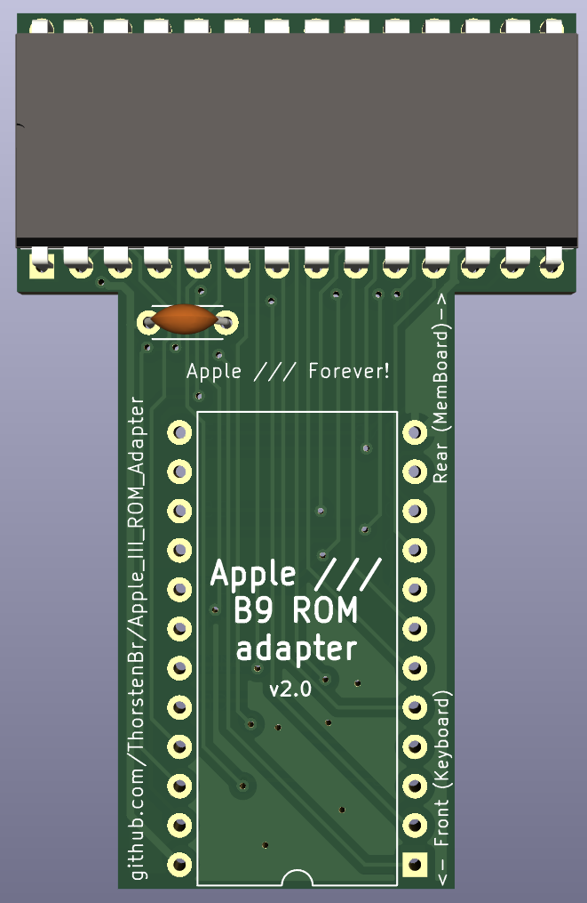

# Apple III ROM Adapter (B9 ROM)
This project contains the design for an adpater the Apple /// "B9" ROM (the main ROM).
The adapter allows to replace the stock 4K ROM with a custom programmable 27C64 EPROM or 28C64 EEPROM (8K).
(The Apple III supports two 4K ROM bank, though the original ROM was only 4K.)
The adapter is useful to replace the stock Apple /// ROM with a variant providing additional features - such as bootstrapping from
harddisks or other devices (such as ProDOS interface cards).

The PCB adapts the Apple ///'s pinout for a "2532" ROM to a more common 27c64/28c64 EPROM/EEPROM.
It also takes care of providing the necessary clearance: the Apple ///'s "B9" ROM is located in a tight space directly below the keyboard. Simple ROM adapters do not fit this space. This adapter was specifically designed with an offset, moving the top (E)PROM further towards the rear of the machine (closer to the memory board), which provides the necessary clearance.

## License
This project is released under the "Creative Commons Attribution 4.0 International Public License". See [LICENSE](LICENSE).

## Schematics and KiCad Project
The [KiCad](KiCad/) folder contains the schematics and PCB project files, if you wished to adapt the design.

A [schematics PDF](KiCad/Apple_III_ROM_Adapter-Schematics.pdf) is also available.

